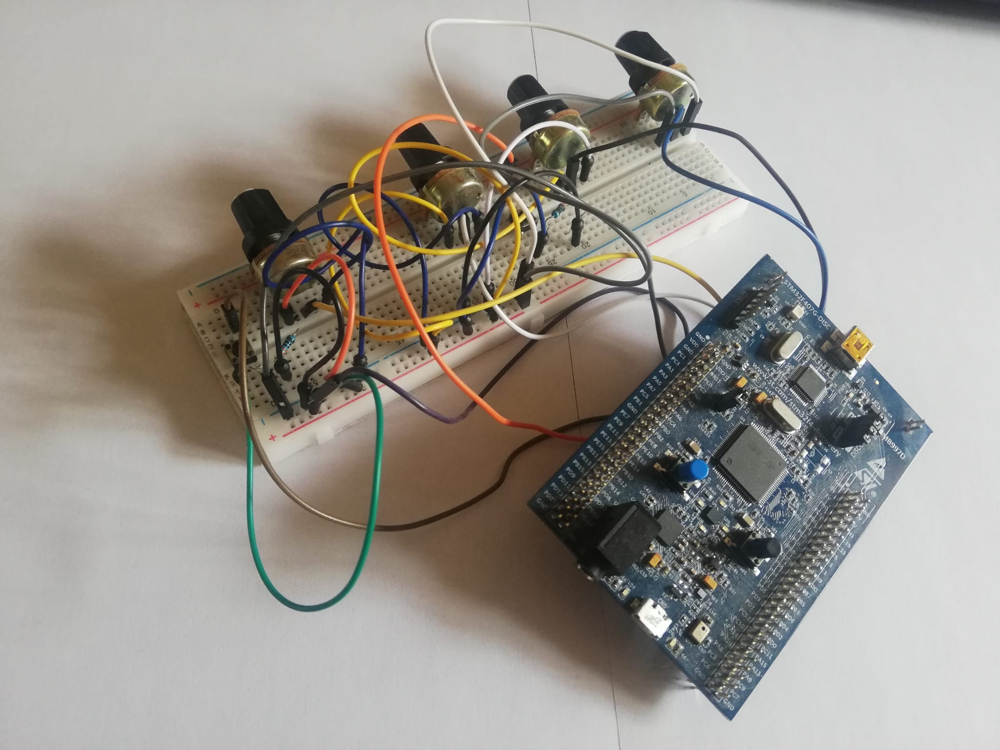
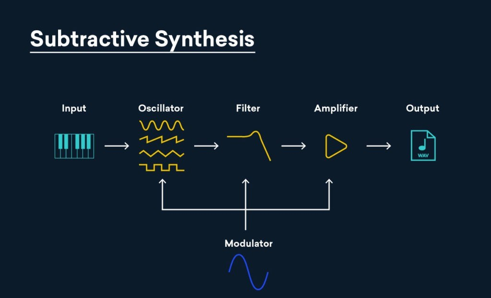
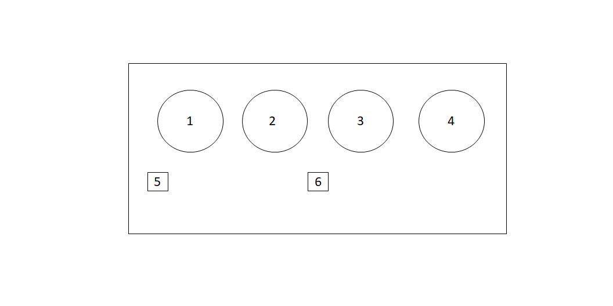

##  Configuration 

In order to compile the firmware and generate the binary file that needs to be flashed into the board, it’s necessary to follow the platform dependant instruction described in the Miosix wiki and to instal the toolchain supported by the operating system (https://miosix.org/wiki/index.php?title=Main_Page).

The compilation is performed using a Makefile, the CMakeList.txt file is instead provided only as a tool to enable indexing in an IDE driven environment and should not be used for compiling the project.


## The Project



Sub-Synth is a monophonic digital synthesizer, developed as a simple prof of concept of our Microaudio framework for digital audio (https://github.com/FedericoDiMarzo/microaudio) developed as a project for the course of Advanced Operating System of Politecnico di Milano. It was developed using the STM32f407vg board, running a version of the Miosix operating system, for which a DAC support of the board (Cirrus Logic cs43l22dac) has been implemented. To controll it , an interface of 4 potentiometers and two buttons was implemented.

Sub-Synth consists of three different type of oscillators (sine, square, white noise) and four biquadratic filters (low pass and high pass of the first order and of the second order) implementing one of the most popular and simple synthesis techniques: subtractive synthesis.
The user can interact with the synth by choose the waveform of the oscillator with a button and then the frequency, he can then choose one of the filters and change the cut of frequency. Finally a potentiometer can be use to controll the volume of the sound synthetized.

In the following image subtractive synthesis is conceptually explained:




## User interface

The stm32-Sub-Synth hardware user interface includes 4 rotary potentiomenters, which allow you to control some of the synthesizer parameters and two buttons which allow to swith beetwen waveforms and filter types.




| Interface Element  | Function |
| ------------- | ------------- |
| 1  | Oscillator frequency controll   |
| 2  | Cut off frequency of the fylter  |
| 3  | Volume  |
| 4  | Resonance of the filter  |
| 5  | Change waveform  |
| 6  | Change filter  |


The ADC reading has been abstracted through the means of a Knob class. Below an example is reported, where 'A' indicates the port on the board and the number the pin:

``` 
Knob cutOff;
cutOff = new Knob("A",2);
cutOffFreq = cutOff->read();
```


